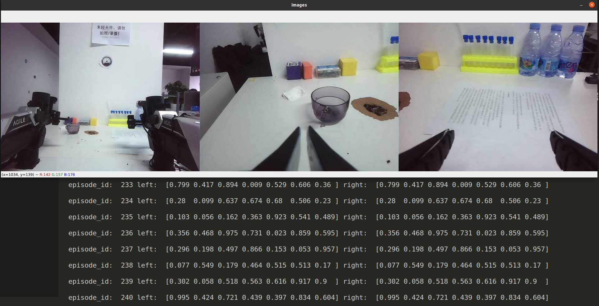
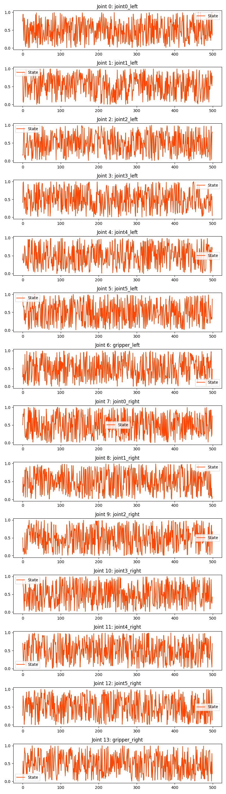
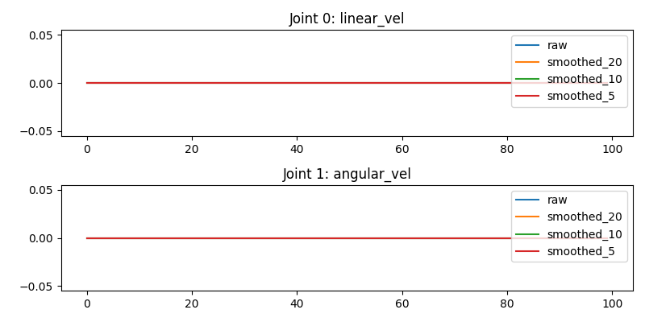

# 1 collect_data环境依赖

# 1.1 ros依赖

+ 默认ubuntu20.04-noetic环境已经配置完成。

~~~python
sudo apt install ros-$ROS_DISTRO-sensor-msgs ros-$ROS_DISTRO-nav-msgs ros-$ROS_DISTRO-cv-bridge
~~~

## 1.2 python库依赖

~~~python
# 1 进入collect_data目录
cd collect_data

# 2 安装requiredments.txt文件中的依赖即可
pip install -r requiredments.txt
~~~

# 2 运行

## 2.1 采集数据

1. 运行
~~~python
# 1 查看collect_data.py配置参数
python collect_data.py -h # 查看参数
~~~

+ 数据采集完成后会保存到`${dataset_dir}/{task_name}`目录下。
~~~python
# 1 启动roscore
roscore

# 2 激活虚拟环境
conda activate aloha

# 3 运行collect_data.py
python collect_data.py --dataset_dir ~/data --max_timesteps 500 --episode_idx 0

# 运行上面这句代码，其他参数采用默认值。产生数据集episode_0.hdf5，该工程目录如下:
collect_data
  ├── collect_data.py
  ├── data                     # --dataset_dir 数据集保存路径
  │   └── aloha_mobile_dummy   # --task_name 任务名
  │       ├── episode_0.hdf5   # 产生数据集文件的位置
          ├── episode_idx.hdf5 # idx由--episode_idx参数决定
          └── ...
  ├── readme.md
  ├── replay_data.py
  ├── requiredments.txt
  └── visualize_episodes.py
~~~

2. 参数详细介绍
  + --dataset_dir 数据集保存路径         
  + --task_name 任务名，作为数据集的文件名                
  + --episode_idx      动作分块索引号             
  + --max_timesteps    最大动作分块的时间步数             
  + --camera_names     相机名称，默认['cam_high', 'cam_left_wrist', 'cam_right_wrist']  
  + --img_front_topic  相机1彩色图话题                     
  + --img_left_topic   相机2彩色图话题                   
  + --img_right_topic  相机3彩色图话题                   
  + --use_depth_image  是否使用深度信息   
  + --depth_front_topic 相机1深度图话题                     
  + --depth_left_topic  相机2深度图话题                    
  + --depth_right_topic 相机3深度图话题                    
  + --master_arm_left_topic  左主臂话题
  + --master_arm_right_topic 右主臂话题                    
  + --puppet_arm_left_topic  左从臂话题                   
  + --puppet_arm_right_topic 右从臂话题                   
  + --use_robot_base         是否使用底盘信息          
  + --robot_base_topic       底盘话题           
  + --frame_rate             采集帧率  因相机图像稳定值为30帧，默认30帧     

# 2.2 可视化数据集
1. 运行
~~~python
# 1 激活虚拟环境
conda activate aloha

# 2 运行visualize_episodes.py
python visualize_episodes.py --dataset_dir ./data --task_name aloha_mobile_dummy --episode_idx 0
~~~
+ 将2.1采集数据进行可视化运行上面代码。`--dataset_dir`、`--task_name`与`--episode_idx`需要与2.1采集数据时相同
+ 运行上面代码，可视化结果如下：
  终端会打印action，并显示一个彩色图像窗口

+ 运行完成后，会在`${dataset_dir}/{task_name}`下产生`episode_${idx}_qpos.png`、`episode_${idx}_base_action.png`与`episode_${idx}_video.mp4`文件，目录结构如下：

~~~python
collect_data
├── data
│   ├── aloha_mobile_dummy
│   │   └── episode_0.hdf5
│   ├── episode_0_base_action.png   # base_action图
│   ├── episode_0_qpos.png          # qpos图
│   └── episode_0_video.mp4         # 彩图图视频流
~~~

+ `episode_${idx}_qpos.png`

  

+ `episode_${idx}_base_action.png`

  

+ `episode_${idx}_video.mp4`

  

2. 参数说明
  + --dataset_dir 数据集保存路径         
  + --task_name 任务名，作为数据集的文件名                
  + --episode_idx      动作分块索引号    

## 2.3 重播数据集
1. 运行
  
  + 将采集的数据集包，使用ros发布该数据包的彩色图和机械
  臂关节姿态
  + 发布该数据包后，cobot_magic可订阅该消息进行示教模式跟随运动
~~~python
# 1 启动roscore
roscore

# 2 激活虚拟环境
conda activate aloha

# 3 发布彩色图、主臂、从臂消息
python replay_data.py --dataset_dir ./data --task_name aloha_mobile_dummy --episode_idx 0

# 4 发布彩色图、从臂消息
python replay_data.py --dataset_dir ./data --task_name aloha_mobile_dummy --only_pub_master --episode_idx 0 
~~~

2. 参数说明
  + --dataset_dir     数据集保存路径         
  + --task_name       任务名，作为数据集的文件名                
  + --episode_idx     动作分块索引号  
  + --only_pub_master 是否只发布主臂的关节姿态消息

## 3 操作命令
~~~python
# 1 启动roscore
roscore

# 2 激活虚拟环境
conda activate aloha

# 3 收集数据
python collect_data.py --max_timesteps 500 --dataset_dir ./data --episode_idx 0

# 4 播放数据，发布ros消息
python replay_data.py --dataset_dir ./data --task_name aloha_mobile_dummy --episode_idx 0

# 5 可视化数据
python visualize_episodes.py --dataset_dir ./data --task_name aloha_mobile_dummy --episode_idx 0
~~~