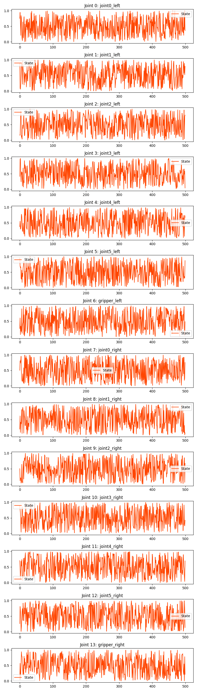
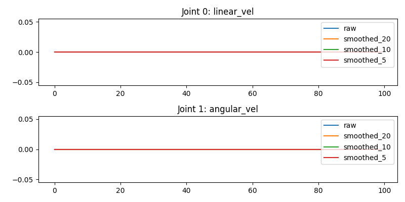

# 环境配置

1. 数据采集基础配置：ubuntu-20.04、ros1-noetic
2. 模型训练推理配置：ubuntu-20.04、ros1-noetic、cuda-11.3、torch-1.11, conda,python-3.8
3. 快速开始请参考[quick_start](https://github.com/agilexrobotics/cobot_magic/blob/main/quick_start.md)

---

+  下载cobot_magic源码

~~~python
# 1 下载源码
git clone https://github.com/agilexrobotics/cobot_magic.git

# 2 进入cobot_magic工作目录
cd cobot_magic
~~~

# 1 相机配置

1. 编译相机驱动

~~~python
# 1 进入ros_astra_camera目录
cd camera_ws

# 2 安装依赖
sudo apt install libgflags-dev libgoogle-glog-dev libusb-1.0-0-dev libeigen3-dev ros-$ROS_DISTRO-image-geometry ros-$ROS_DISTRO-camera-info-manager ros-$ROS_DISTRO-image-transport ros-$ROS_DISTRO-image-publisher ros-$ROS_DISTRO-libuvc-ros  -y

# 3 编译
catkin_make

# 4 Install udev rules.
source devel/setup.bash && rospack list
roscd astra_camera
./scripts/create_udev_rules
sudo udevadm control --reload && sudo  udevadm trigger

# 5 增加永久ros_astra_camera包的环境变量
## 5.1 进入astra_ws目录
cd ../..
## 5.2 增加环境变量
echo "source $(pwd)/devel/setup.bash" >> ~/.bashrc 
## 5.3 环境变量生效
source ~/.bashrc 
~~~

2. 运行

工控机接上astra相机的usb
~~~python
# 1 检测相机序列号
rosrun astra_camera list_devices_node
# 终端显示
## 1.1 显示如下： 表示相机未连接，请重新拔插usb
# [ INFO] [1710298393.524932942]: Found 0 devices 

## 1.2 显示如下： 一个Serial number，即表示相机已经成功连接
# [ INFO] [1710298585.382430351]: Found 1 devices
# Device connected: Astra
# URI: 2bc5/0657@1/11
# Serial number: CC1GA35002L  

# 2 启动相机
roslaunch astra_camera dabai.launch

# 3 打开rqt_image_view查看图像
rqt_image_view
## 显示如下图， 注意先刷新再选择对应的话题即可显示图像
~~~

  

3. 重新编译
~~~python
catkin_make clean && catkin_make
~~~

4. 配置多相机

+ 这里测试3个相机, 工控机接上3个astra相机的usb, 

~~~python
# 1 检测相机序列号
rosrun astra_camera list_devices_node
## 终端显示如下：
# [ INFO] [1710299519.592966536]: Found 3 devices
# Device connected: Astra
# URI: 2bc5/060e@1/29
# Serial number: AU1231201GE
# Device connected: Astra
# URI: 2bc5/060e@1/35
# Serial number: AU1953304F2
# Device connected: Astra
# URI: 2bc5/060e@1/24
# Serial number: AU1P32201SA

## 发现3个devices, 即表示相机连接成功, 记住这3个Serial number, 后续会使用
## 未发现3个devices, 请检测测相机usb线是否成功连接

# 2 修改multi_camera.launch配置文件
## 修改camera_ws/src/ros_astra_camera/launch/multi_camera.launch第13左右相机的Serial number值
## 将1中输出的3个Serial number值，分别填入下面代码中即可
<arg name="camera1_serila_number" default="AU1231201GE"/>
<arg name="camera2_serila_number" default="AU1953304F2"/>
<arg name="camera3_serila_number" default="AU1P32201SA"/>

# 3 启动多相机
roslaunch astra_camera multi_camera.launch
## 使用rqt_image_view即可查看相应的图像话题
~~~

# 2 机械臂配置

## 2.1 环境安装

1. 安装依赖
~~~python
# 1 进入remote_control目录
cd remote_control

# 2 安装依赖
sudo apt install can-utils net-tools libkdl-parser-dev -y
~~~

[canable](https://canable.io/updater/udev.html)

1. 安装依赖
~~~python
sudo apt install can-utils net-tools libkdl-parser-dev -y
~~~

2. 查看机械臂的serial号

机械臂按顺序依次进行以下操作：
+ 机械臂上电
+ 机械臂usb插入工控机
+ 查看serial号
~~~python
# 1 查看ttyACM
ls /dev/ttyACM*
## 终端显示ttyACM0, 下面就用/dev/ttyACM0查看serial序列号

# 2 查看serial号
udevadm info -a -n /dev/ttyACM0 | grep serial
~~~

+ 拔掉usb, 换下一条臂继续上面操作, 记录下每条臂的serial号

3. 构建规则

新建arx_can.rules文件，内容如下

+ 需要修改serial号内容
~~~python
# ATTRS{serial}=="自己对应的串口号内容"
SUBSYSTEM=="tty", ATTRS{idVendor}=="16d0", ATTRS{idProduct}=="117e", ATTRS{serial}=="207D38544D4D", SYMLINK+="canable0"
SUBSYSTEM=="tty", ATTRS{idVendor}=="16d0", ATTRS{idProduct}=="117e", ATTRS{serial}=="207938A14D4D", SYMLINK+="canable1"
SUBSYSTEM=="tty", ATTRS{idVendor}=="16d0", ATTRS{idProduct}=="117e", ATTRS{serial}=="2068385D4D4D", SYMLINK+="canable2"
SUBSYSTEM=="tty", ATTRS{idVendor}=="16d0", ATTRS{idProduct}=="117e", ATTRS{serial}=="208E386A4D4D", SYMLINK+="canable3"
~~~

4. 更新rule
~~~python
# 1 添加权限
chmod +x arx_can.rules

# 2 将arx_can.rules拷贝到/etc/udev/rules.d/目录下
sudo cp arx_can.rules /etc/udev/rules.d/

# 3 更新rule
sudo udevadm control --reload-rules && sudo udevadm trigger
~~~

## 2.2 绑定机械臂can口

1. 绑定can口
开机上电, 电脑插上4条机械臂的can转usb口接线

2. 新建can.sh文件，can.sh内容如下
+ 需要将password设置成本机的密码
~~~python
#!/bin/bash
source ~/.bashrc
password=1   # 修改这一行即可

gnome-terminal -t "can" -x bash -c "source ~/.bashrc;source /opt/ros/noetic/setup.bash;echo $password | sudo -S slcand -o -f -s8 /dev/canable0 can0;sudo ifconfig can0 up;exec bash;"
gnome-terminal -t "can" -x bash -c "source ~/.bashrc;source /opt/ros/noetic/setup.bash;echo $password | sudo -S slcand -o -f -s8 /dev/canable0 can0;sudo ifconfig can0 up;exec bash;"
gnome-terminal -t "can" -x bash -c "source ~/.bashrc;source /opt/ros/noetic/setup.bash;echo $password | sudo -S slcand -o -f -s8 /dev/canable0 can0;sudo ifconfig can0 up;exec bash;"

gnome-terminal -t "can" -x bash -c "source ~/.bashrc;source /opt/ros/noetic/setup.bash;echo $password | sudo -S slcand -o -f -s8 /dev/canable1 can1;sudo ifconfig can1 up;exec bash;"
gnome-terminal -t "can" -x bash -c "source ~/.bashrc;source /opt/ros/noetic/setup.bash;echo $password | sudo -S slcand -o -f -s8 /dev/canable1 can1;sudo ifconfig can1 up;exec bash;"
gnome-terminal -t "can" -x bash -c "source ~/.bashrc;source /opt/ros/noetic/setup.bash;echo $password | sudo -S slcand -o -f -s8 /dev/canable1 can1;sudo ifconfig can1 up;exec bash;"

gnome-terminal -t "can" -x bash -c "source ~/.bashrc;source /opt/ros/noetic/setup.bash;echo $password | sudo -S slcand -o -f -s8 /dev/canable2 can2;sudo ifconfig can2 up;exec bash;"
gnome-terminal -t "can" -x bash -c "source ~/.bashrc;source /opt/ros/noetic/setup.bash;echo $password | sudo -S slcand -o -f -s8 /dev/canable2 can2;sudo ifconfig can2 up;exec bash;"
gnome-terminal -t "can" -x bash -c "source ~/.bashrc;source /opt/ros/noetic/setup.bash;echo $password | sudo -S slcand -o -f -s8 /dev/canable2 can2;sudo ifconfig can2 up;exec bash;"

gnome-terminal -t "can" -x bash -c "source ~/.bashrc;source /opt/ros/noetic/setup.bash;echo $password | sudo -S slcand -o -f -s8 /dev/canable3 can3;sudo ifconfig can3 up;exec bash;"
gnome-terminal -t "can" -x bash -c "source ~/.bashrc;source /opt/ros/noetic/setup.bash;echo $password | sudo -S slcand -o -f -s8 /dev/canable3 can3;sudo ifconfig can3 up;exec bash;"
gnome-terminal -t "can" -x bash -c "source ~/.bashrc;source /opt/ros/noetic/setup.bash;echo $password | sudo -S slcand -o -f -s8 /dev/canable3 can3;sudo ifconfig can3 up;exec bash;"

gnome-terminal -t "can" -x bash -c "source ~/.bashrc;source /opt/ros/noetic/setup.bash;echo $password | sudo -S slcand -o -f -s8 /dev/canable6 can6;sudo ifconfig can6 up;exec bash;"
gnome-terminal -t "can" -x bash -c "source ~/.bashrc;source /opt/ros/noetic/setup.bash;echo $password | sudo -S slcand -o -f -s8 /dev/canable6 can6;sudo ifconfig can6 up;exec bash;"
gnome-terminal -t "can" -x bash -c "source ~/.bashrc;source /opt/ros/noetic/setup.bash;echo $password | sudo -S slcand -o -f -s8 /dev/canable6 can6;sudo ifconfig can6 up;exec bash;"
~~~

+ can.sh文件加权限
~~~python
chmod +x can.sh
~~~

3. 执行can.sh

~~~python
./can.sh
~~~

4. 查看can口信息
执行上面代码后，查看can口是否生效

~~~python
ifconfig | grep can
# 显示内容如下即can口, 即可以正常启动机械臂：
can0: flags=193<UP,RUNNING,NOARP>  mtu 16
can1: flags=193<UP,RUNNING,NOARP>  mtu 16
can2: flags=193<UP,RUNNING,NOARP>  mtu 16
can3: flags=193<UP,RUNNING,NOARP>  mtu 16
~~~

## 2.3 启动机械臂
~~~python

# 1 修改remote_control/tools/start.sh中password参数
password=1 # 修改成自己的电脑密码即可, 本机密码为1就改成1

# 2 进入remote_control目录
cd remote_control

# 3 启动4条机械臂
./tools/start.sh
~~~

# 3 数据采集

+ 默认ubuntu20.04-noetic环境已经配置完成。

## 3.1 环境依赖

~~~python
# 1 ros依赖
sudo apt install ros-$ROS_DISTRO-sensor-msgs ros-$ROS_DISTRO-nav-msgs ros-$ROS_DISTRO-cv-bridge

# 2 python依赖
## 2.1 进入当前工作么空间目录，安装requiredments.txt文件中的依赖即可
cd collect_data

## 2.2 安装requiredments.txt
pip install -r requiredments.txt
~~~

## 3.2 运行

### 3.2.1 采集数据

1. 运行
~~~python
# 1 查看collect_data.py配置参数
python collect_data.py -h # 查看参数
~~~

+ 数据采集完成后会保存到`${dataset_dir}/{task_name}`目录下。
~~~python
# 1 启动roscore
roscore

# 2 激活虚拟环境
conda activate aloha

# 3 启动采集数据
python collect_data.py --dataset_dir ~/data --max_timesteps 500 --episode_idx 0

# 运行上面这句代码，其他参数采用默认值。产生数据集episode_0.hdf5，该工程目录如下
collect_data
  ├── collect_data.py
  ├── data                     # --dataset_dir 数据集保存路径
  │   └── aloha_mobile_dummy   # --task_name 任务名
  │       ├── episode_0.hdf5   # 产生数据集文件的位置
          ├── episode_idx.hdf5 # idx由--episode_idx参数决定
          └── ...
  ├── readme.md
  ├── replay_data.py
  ├── requiredments.txt
  └── visualize_episodes.py
~~~

2. 参数详细介绍
  + --dataset_dir 数据集保存路径         
  + --task_name 任务名，作为数据集的文件名                
  + --episode_idx      动作分块索引号             
  + --max_timesteps    最大动作分块的时间步数             
  + --camera_names     相机名称，默认['cam_high', 'cam_left_wrist', 'cam_right_wrist']  
  + --img_front_topic  相机1彩色图话题                     
  + --img_left_topic   相机2彩色图话题                   
  + --img_right_topic  相机3彩色图话题                   
  + --use_depth_image  是否使用深度信息   
  + --depth_front_topic 相机1深度图话题                     
  + --depth_left_topic  相机2深度图话题                    
  + --depth_right_topic 相机3深度图话题                    
  + --master_arm_left_topic  左主臂话题
  + --master_arm_right_topic 右主臂话题                    
  + --puppet_arm_left_topic  左从臂话题                   
  + --puppet_arm_right_topic 右从臂话题                   
  + --use_robot_base         是否使用底盘信息          
  + --robot_base_topic       底盘话题           
  + --frame_rate             采集帧率  因相机图像稳定值为30帧，默认30帧    

### 3.2.2 可视化数据集
1. 运行
~~~python
# 1 激活虚拟环境
conda activate aloha

# 2 运行visualize_episodes.py
python visualize_episodes.py --dataset_dir ./data --task_name aloha_mobile_dummy --episode_idx 0
~~~
+ 将2.1采集数据进行可视化运行上面代码。`--dataset_dir`、`--task_name`与`--episode_idx`需要与2.1采集数据时相同
+ 运行上面代码，可视化结果如下：
  终端会打印action，并显示一个彩色图像窗口

+ 运行完成后，会在`${dataset_dir}/{task_name}`下产生`episode_${idx}_qpos.png`、`episode_${idx}_base_action.png`与`episode_${idx}_video.mp4`文件，目录结构如下：

~~~python
collect_data
├── data
│   ├── aloha_mobile_dummy
│   │   └── episode_0.hdf5
│   ├── episode_0_base_action.png   # base_action图
│   ├── episode_0_qpos.png          # qpos图
│   └── episode_0_video.mp4         # 彩图图视频流
~~~

+ `episode_${idx}_qpos.png`

  

+ `episode_${idx}_base_action.png`

  

+ `episode_${idx}_video.mp4`

  

2. 参数说明
  + --dataset_dir 数据集保存路径         
  + --task_name 任务名，作为数据集的文件名                
  + --episode_idx      动作分块索引号    

### 3.2.3 重播数据集
1. 运行
  
  + 将采集的数据集包，使用ros发布该数据包的彩色图和机械
  臂关节姿态
  + 发布该数据包后，cobot_magic可订阅该消息进行示教模式跟随运动
~~~python
# 1 启动roscore
roscore

# 2 激活虚拟环境
conda activate aloha

# 3 发布彩色图、主臂、从臂消息
python replay_data.py --dataset_dir ./data --task_name aloha_mobile_dummy --episode_idx 0

# 4 发布彩色图、从臂消息
python replay_data.py --dataset_dir ./data --task_name aloha_mobile_dummy --only_pub_master --episode_idx 0 
~~~

2. 参数说明
  + --dataset_dir     数据集保存路径         
  + --task_name       任务名，作为数据集的文件名                
  + --episode_idx     动作分块索引号  
  + --only_pub_puppet 是否只发布主臂的关节姿态消息

## 3.3 操作命令
~~~python
# 1 启动
roscore

# 2 激活虚拟环境
conda activate aloha

# 3 收集数据
python collect_data.py --max_timesteps 500 --dataset_dir ./data --episode_idx 0

# 4 播放数据，发布ros消息
python replay_data.py --dataset_dir ./data --task_name aloha_mobile_dummy --episode_idx 0

# 5 可视化数据
python visualize_episodes.py --dataset_dir ./data --task_name aloha_mobile_dummy --episode_idx 0
~~~

# 4 ACT训练推理

## 4.1 环境配置

+ ubuntu-20.04,cuda-11.8,cudnn-8.6.0,torch-2.1.1已测试通过

~~~python
# 1 创建conda虚拟环境
conda create -n aloha python=3.8

# 2 激活虚拟环境
conda activate aloha

# 3 安装torch-2.1.1
pip install torch==2.1.1 torchvision==0.16.1 torchaudio==2.1.1 --index-url https://download.pytorch.org/whl/cu118

# 4 安装requrements.txt
pip install -r requrements.txt

# 5 安装detr
cd aloha-devel/act/detr && pip install -v -e .
~~~

详情请参考[mobile-aloha](https://github.com/MarkFzp/mobile-aloha) 、[act-plus-plus](https://github.com/MarkFzp/act-plus-plus)

## 4.2 数据集采集

+ 详细参考[collect_data工程](https://github.com/agilexrobotics/cobot_magic/blob/main/collect_data/readme.md)

## 4.3 训练

~~~python
# 1 激活虚拟环境
conda activate aloha

# 2 训练
python act/train.py --dataset /media/lin/T7/data0314/ --ckpt_dir train_dir --batch_size 48 --num_epochs 2000
~~~

1. 主要参数参数说明 目前仅支持ACT模型训练
    + --dataset     数据集目录
    + --ckpt_dir    训练模型保存目录
    + --batch_size  训练批量大小
    + --num_epochs  训练周期
    + --task_name   任务名称
    + --pretrain_ckpt_dir 预训练模型路径
    + --ckpt_name   模型名称

## 4.4 推理
~~~python
# 1 启动roscore
roscore

# 2 启动从臂与相机
## 2.1 进入follow_control目录
cd follow_control

## 2.2 执行start.sh脚本
./tools/start.sh

# 3 推理
## 3.1 激活虚拟环境
conda activate aloha

## 3.2 执行推理
python inference.py --ckpt_dir train_dir
~~~
